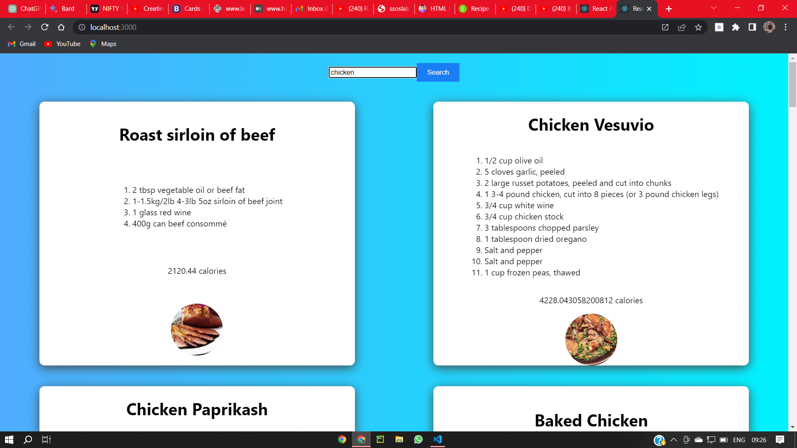

# Getting Started with react-recipe app

This project was bootstrapped with [Create React App](https://github.com/facebook/create-react-app).

# About
This is a React-based recipe app that retrieves recipe data from an API and displays the recipe name, calories, ingredients, and an accompanying image.

# Features
Fetches recipe data from an API
Displays recipe name, calories, ingredients, and an image
Allows users to search for recipes
Responsive design for mobile and desktop

# screenshots 
-home page
 
 .png)
